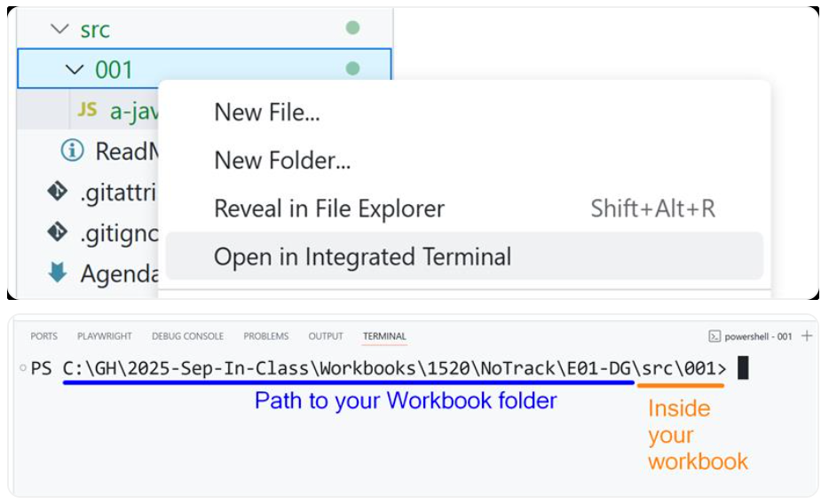

# Know Your Tools 

At the core, you really, really need to know how to install software on your computer. If you are struggling with basics such as [**how to install software**](https://www.computerhope.com/issues/ch000561.htm), then you had better master the subject - and *fast!* If you can't (or *won't*) learn how to do this *on your own*, then (I know this sounds harsh) you should consider a different career than Information Technology!

> Microsoft lists various [SQL Tools](https://docs.microsoft.com/en-us/sql/tools/overview-sql-tools?view=sql-server-ver16). Here are some quick notes on the tools commonly used in this course.


- **VS Code** (*Preferred*)
  - Review the official VS Code Docs on:
    - [ ] [JavaScript in Visual Studio Code](https://code.visualstudio.com/docs/languages/javascript)
    - [ ] [Working with JavaScript](https://code.visualstudio.com/docs/nodejs/working-with-javascript)
  - Review the notes on using the [GitDoc extension](https://github.com/lostintangent/gitdoc#gitdoc-). Also review these instructions on how to turn on [AutoSave in VS Code](https://neutrondev.com/vs-code-auto-save/).
<!--  - Watch [**The New Way To Debug JavaScript in VS Code - No Extension Required**](https://youtu.be/tC91t9OvVHA) (Video - 7:20 - July 2021) -->
  - **Practice** writing [Markdown](https://commonmark.org/help/)
  - Get comfortable with the **terminal** (and how to open it in a particular folder).

    

- **git** and **GitHub CLI**
  - When not using GitDoc and Autosave (see above), you need to always follow [**The Routine**](./TheRoutine.md)

## Some Markdown Examples

You can add images in your markdown.


```markdown

```

In the preview it shows the image via an `` tag.

```html

```
