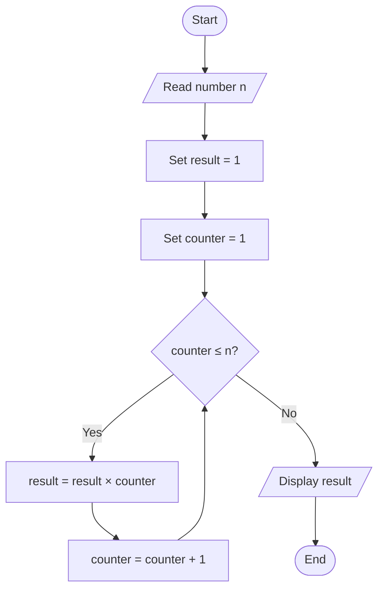
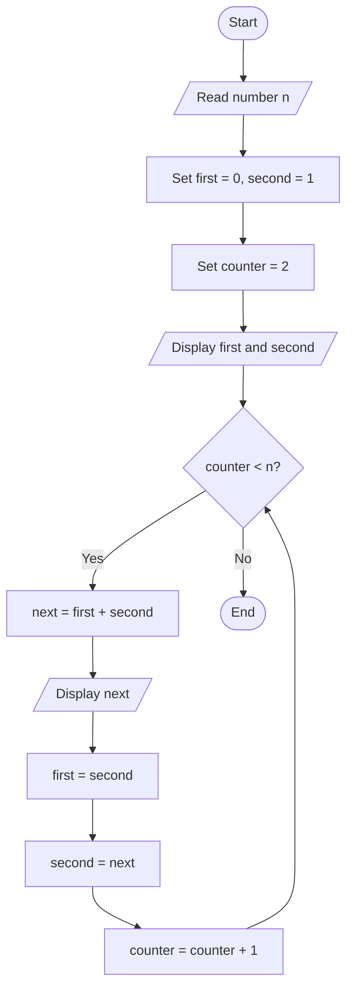

# JavaScript Only

Can you create functions for the following algorithms?

## Factorial

```mermaid
flowchart TD
    A([Start]) --> B[/Read number n/]
    B --> C[Set result = 1]
    C --> D[Set counter = 1]
    D --> E{counter ≤ n?}
    E -- Yes --> F[result = result × counter]
    F --> G[counter = counter + 1]
    G --> E
    E -- No --> H[/Display result/]
    H --> I([End])
```

## Fibonacci

```mermaid
flowchart TD
    A([Start]) --> B[/Read number n/]
    B --> C[Set first = 0, second = 1]
    C --> D[Set counter = 2]
    D --> E[/Display first and second/]
    E --> F{counter < n?}
    F -- Yes --> G[next = first + second]
    G --> H[/Display next/]
    H --> I[first = second]
    I --> J[second = next]
    J --> K[counter = counter + 1]
    K --> F
    F -- No --> L([End])
```

