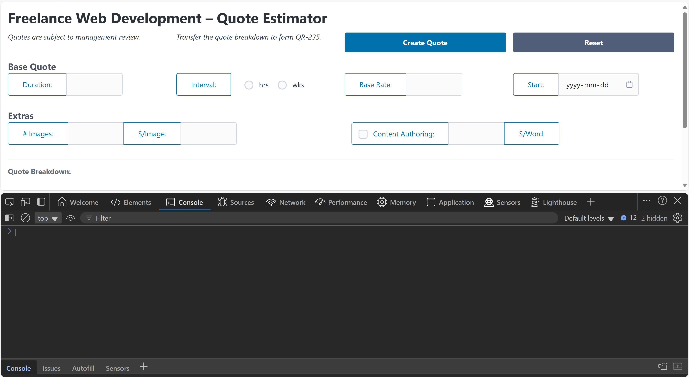
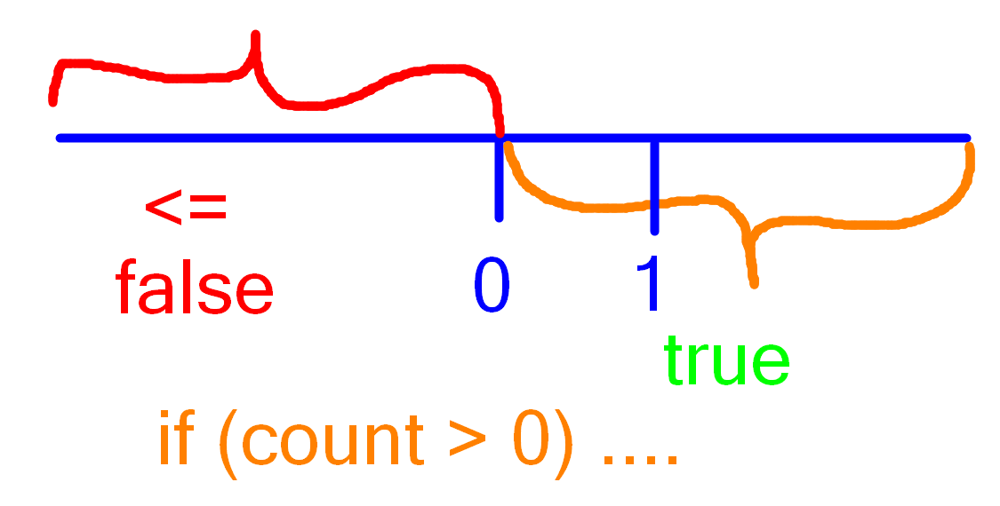
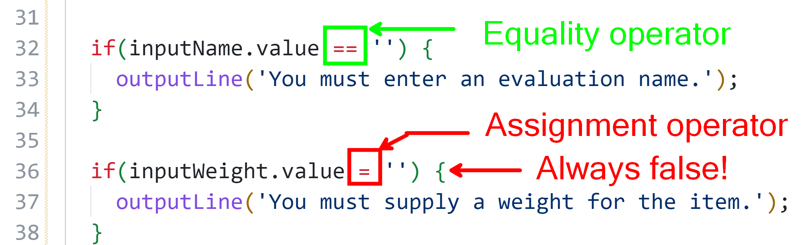
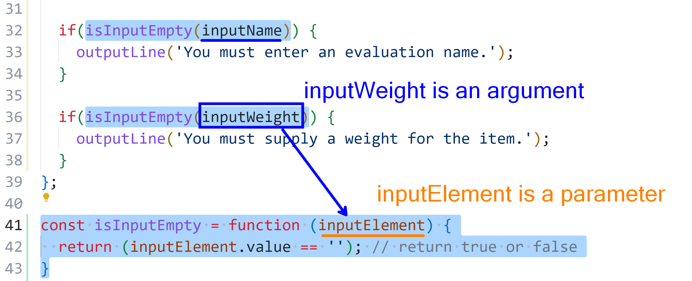
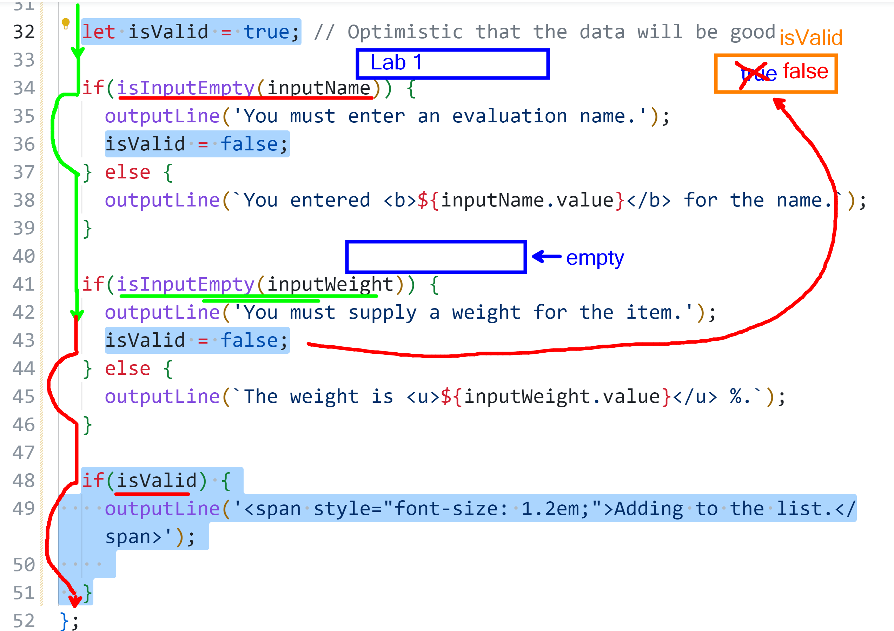

# If-Else & Forms 

> Review the [**LOGs**](./LOGs.md) for this class.

Also see the [Notes](#notes) near the end.

----

## If-Else And Conditional Expressions

Run the following command from a terminal in the `JS-Quickstart` directory.

```ps
node --watch grok-decisions.mjs
```

### Falsey or Falsy

> The correct term is **"falsy"**, which refers to values that evaluate to false in boolean contexts. In programming, particularly in languages like JavaScript, falsy values include null, empty strings, and zero, which are not considered true in Boolean evaluation. The term "falsey" is also used but is less common and may sound made up to some people.
>
> [source](./images/falsy-bing-ai.png) - see also [here](https://www.geeksforgeeks.org/javascript/explain-the-concept-of-truthy-falsy-values-in-javascript/)

----

## **Shipping Calculator** - Demo
  - Review the code to perform the calculations for the [Shipping Calculator](./shipping-calculator/Readme.md) sample together in class.

----

## Quote System



Other than the basic HTML form input controls, there is no HTML/CSS validation. All of the validation, you will have to perform via JavaScript.

----

## Notes

### If-Else Statements

The If-Else statement follows this grammar:

```js
if(conditionalExpression)
    statementOrStatementBlock
else
    statementOrStatementBlock
```

where the `conditionalExpression` is some expression that will result in a true or false value, and the `statementOrStatementBlock` is either a single instruction/statement or a set of statements inside curly braces (statement block).

### Relational Operators

Relational operators do a comparison between two items (the LH or "Left-Hand side" and the RH or "Right-Hand side"). All relational operations return a result of `true` or `false`.

-   **`==`** — "is equal to" - equality operator
-   **`===`** — "is equal to" - identity operator
-   **`!=`** — "is not equal to" - equality operator
-   **`!===`** — "is not equal to" - identity operator
-   **`>`** — greater than
-   **`<`** — less than
-   **`>=`** — greater than or equal to
-   **`<=`** — less than or equal to

### Logical Operators

Logical Operators do a comparison between boolean values for `&&` and `||` operators. The *unary* operator for "NOT" (`!`) will flip a true into a false and a false into a true.

-   **`&&`** — "AND" operator - both sides must be true to get a true result
-   **`||`** — "OR" operator - only one side needs to be true to get a true result
-   **`!`** &mdash: "NOT" operator - inverts the true to a false and the false to a true

----

## Ad-hoc Class Notes

The opposite of `>` is `<=`. Think of a number line.



Don't mistake the assignment operator for the equality operator.



Re-usable functions are very helpful! You declare the function with whatever parameters (if any) you want, and then you **call** the function sending in *arguments*.



If-Else provides a way to control the **flow of execution** of your code during run-time.



----
