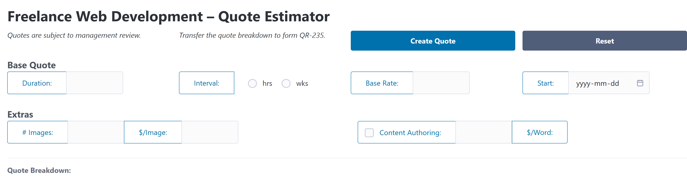

# Quote System

Freelance web development

- [ ] **TODO:** Put in `~/sk/009` (complete re-write)
  - [ ] "Scavange" from 012??
  - [ ] `node --watch if-else.js`
  - [ ] `node --watch switch-case.js`

This form should be filled out by the freelancer after performing the initial interview with the client.

- x hours/weeks at $/hour
- base starting rate - $1,000
- y digital assets at $10 each
- content authoring at $0.25/word for 1000 words (or less)
- scheduled start date
- `<output>` elements to hold 
    - the calculated price
    - the estimated start date

Principles

1. Keep the handler function (event listener) **self-contained**
    - Leverage `event.target` to get the form, and then the target's `.elements` collection.
1. Use **JS Modules**
1. Demonstrate:
    - **Form Processing**
        - `.preventDefault()`
        - `.elements.inputName` vs. `.elements[kebab-name]`
        - `.value` of `<input>` and `<select>` elements
    - **`if`/`else` Statements**
        - Relational operators
        - Logical operators
        - Nesting `if`/`else` vs. complex conditions (e.g.: use of logical operators `&&` and `||` along with parenthesis to control operator precidence)
    - **Template Strings**
        - Along with `.innerHTML` of DOM elements
    - **DOM Properties/Methods**
        - `.innerHTML`
        - `.setAttribute(attName, value)`
        - `.getAttribute(attName)`
    - ***Helpful Extras***
        - Number functions:
            - `.toFixed(digits)` - to specify the number of decimals when converting to a string (fixed-precision)
        - String functions:
            - `.trim()` - to get rid of leading/trailing whitespace
            - `.endsWith(partial)` - returns a `true`/`false` if a string ends with some `partial` string

