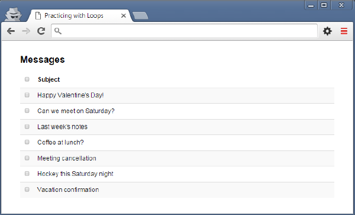
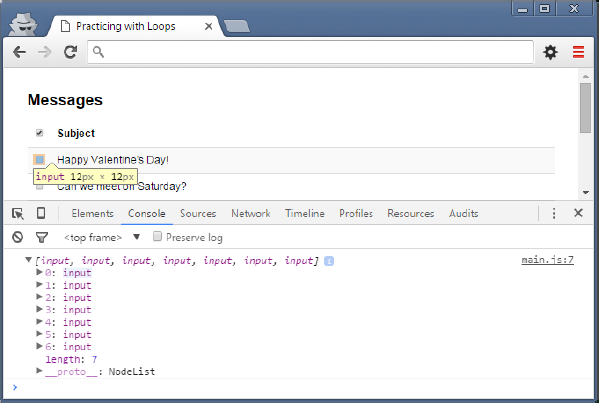
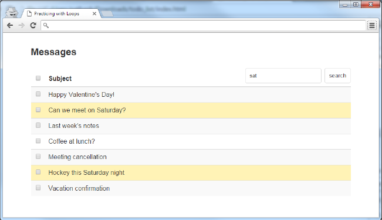

# Working with Loops and NodeLists

## `.querySelectorAll()`

> To follow along with this Demo, run `pnpm i` and `pnpm dev` in this folder.

We discovered in the past that using `document.querySelector()` will give us the *first* DOM element that matches the selector string. But what if we want ***all*** the elements that match the selector? That's where **`.querySelectorAll()`** comes in!

The `.querySelectorAll()` method will give us a **NodeList** of zero or more results. While similar in concept to *arrays* (covered in upcoming demos), it's important to remember that a *NodeList* is **not** an array. But, it is a *collection*, and it has a property called `.length` which can help us in processing the DOM elements.

## Checkboxes

In this example, we have a simple interface displaying message subject lines and checkboxes. We will allow the user to toggle all checkboxes on a page when they click the "Subject" checkbox.



1. To begin, add an event listener for the `<input type="checkbox" name="toggle" />` element. This first checkbox has a unique name that we can use as its selector; the event we want to respond to is the **change** event.

    ```js
    const toggleAll = document.querySelector('[name=toggle]');
    toggleAll.addEventListener('change', function (evt) {
        const target = evt.target;
        console.log(`main toggle is ${target.checked ? 'on' : 'off'}`);
    ));
    ```

1. Test that you have your event listener properly added and that checking/unchecking the first checkbox displays the output in the console.

1. Within that event listener, select all the inputs that have the `name="message"` attribute. Log the results and inspect them in the Browser Dev Tool's console.

    ```js
    const allCheckboxes = document.querySelectorAll('[name=toggle]');
    console.log(allCheckboxes);
    ```

1. You should now see a list of all the checkbox elements in the console when the toggle is changed:

    


    Notice how all the input elements are contained between brackets with commas separating them. The first input in the list is active and you can see the highlighted checkbox it corresponds with in the table above it.

1. Our next step is to *iterate* (loop) over all the checkboxes and modify their `.checked` property to match that of our `target` checkbox.

    ```js
    let index = 0;
    while(index < allCheckboxes.length) {
        allCheckboxes[index].checked = target.checked;
        index += 1;
    }
    ```

1. How might you re-write the loop to use a traditional `for` statement? Give it a try!


## Challenge Modifications

As a challenge, update the HTML of this exercise with a **search form**. *(You should also add any extra CSS classes/styling to make it look it good.)* The form should include the following:

- Text Input
- Submit button

This search form should allow the user to search for and highlight matches in the subject lines of the displayed messages (partial matches included). The following image shows an example of a search:



Take some time to really think about this one before you being coding.
