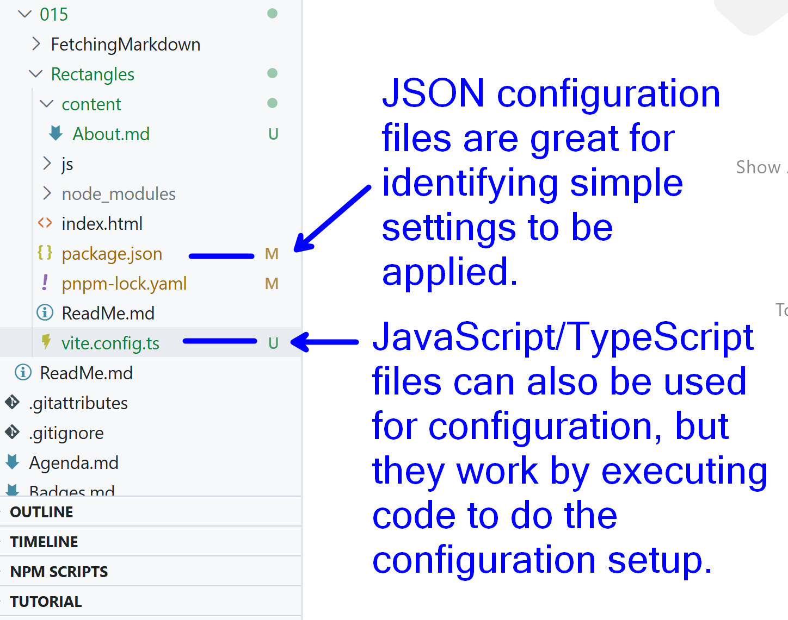

# The Rectangles Demo

This demo introduced JavaScript classes as a means for creating objects. All of the information on the objects (*instantiated* from the `Rectangle` class) was displayed in the browser's `console.log()`.

## Expanding the Demo

We're going to expand the demo in a few ways. This documentation will be helpful for us if we ever need to revisit and "replicate" it in other projects.

- Including [Tailwind CSS](https://tailwindcss.com)
- Apply Tailwind styles semantically in our `./css/styles.css` file
- Add a `.render()` function for our `Rectangle` class so that it can create HTML "fragements" that can added to the DOM.

### Setup of Tailwind

We'll be using the Tailwind instructions for a basic Vite application. This is going to involve specific steps (document in the Tailwind "Getting Started" page).

Part of the steps involves creating a `vite.config.ts`. This configuration file allows us to define Tailwind CSS as a "plug-in" for our web project.



### Apply Tailwind for Semantic HMTL

Most examples of using Tailwind (including those on Tailwind's own website) demonstrate using their utility classes by putting `class` attributes directly on the HTML. While convenient for quick demos, it suffers the curse of "Quick-n-Dirty".

Often, a better way is to keep *Semantic HTML* by avoiding (or at least minimizing) the use of `class` attributes. Tailwind makes this super easy thanks to their custom `@apply` CSS rule.

In a `styles.css`, we will be applying Tailwind classes to elements based on their HTML tags. Here's a partial example.

```css
/* ./css/styles.css */
@import "tailwindcss";

body {
    /* Don't worry about the yellow squiggle */
    @apply container pt-4 px-4;
}

h1 {
    @apply font-bold text-3xl text-indigo-700;
}
```

Now that we've got some cleaner ways to use styling for our page contents, we can move on to rendering the rectangles.

### Rendering Rectangles

Rendering our rectangle objects on the page can be done in several ways. We'll take the most direct way by adding a `.render()` method to our `Rectangle` class. This method has one parameter: some HTMLElement to which we will append the rectangle object. We'll use the rectangle's height and width as a representation of its dimensions in pixels.

> *See the `main.js` for the rendering code.*

## Extra Practice

Can you create a navbar using Tailwind? What about a link that will `fetch()` this markup document and render it on the page? These are extra tasks you can work on to explore both Tailwind and JavaScript.
