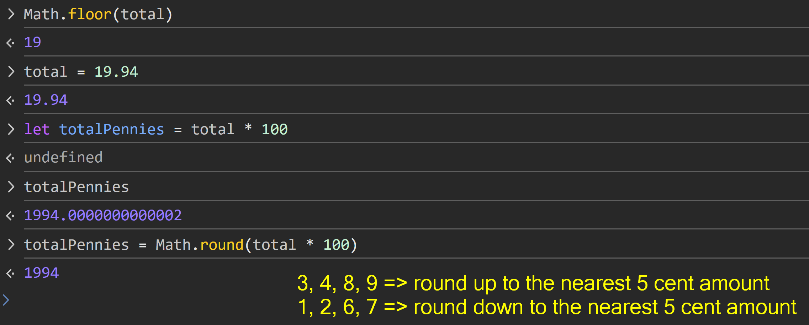
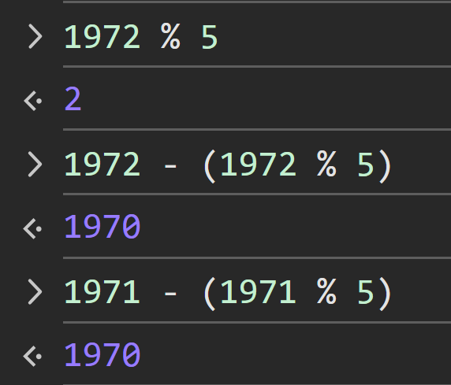
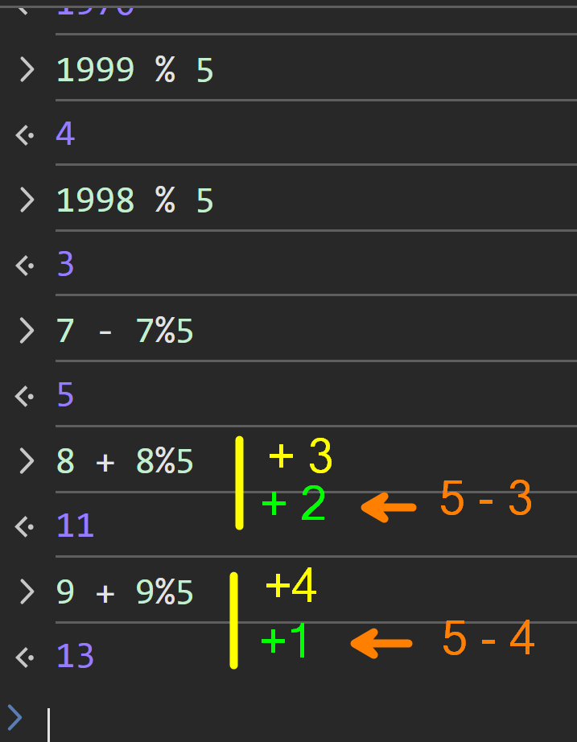

# Unit Testing

## Cash Register

When it comes to dealing with cash, it's important to work in **whole numbers**, particularly if you need to do any math.

In the case of Canadian dollars, we have *special rules* regarding rounding. That's because we no longer have the "penny" as legal cash tender. Instead, we round to the nearest nickel.

Sometimes we need to round down:

Sometimes we need to round up:

